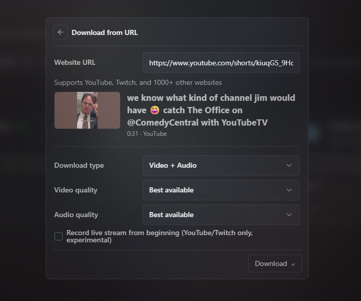

# Video Downloader - Sigma File Manager Extension 

Download videos, playlists, audio, and streams from YouTube, Twitch, and 1000+ other websites.

## Features

- Download videos, playlists, audio, or streams from URL
- Choose download mode: video + audio, video only, or audio only
- Select video and audio quality presets
- Supports YouTube, Twitch, and thousands of other websites (see [supported sites](https://github.com/yt-dlp/yt-dlp/blob/master/supportedsites.md))

## Usage

1. Open the command palette `Ctrl+Shift+P`
2. Find and run command **Video Downloader: Download from URL**
3. Enter the URL and select quality options
4. Downloaded files are saved to the current directory

## Notes

- `Download directory`: The media is downloaded to the currently opened directory in navigator view, otherwise it falls back to `Downloads` directory.
- `YouTube`: Before you can start downloading videos from YouTube, you will be prompted to provide your YouTube account cookies first.
